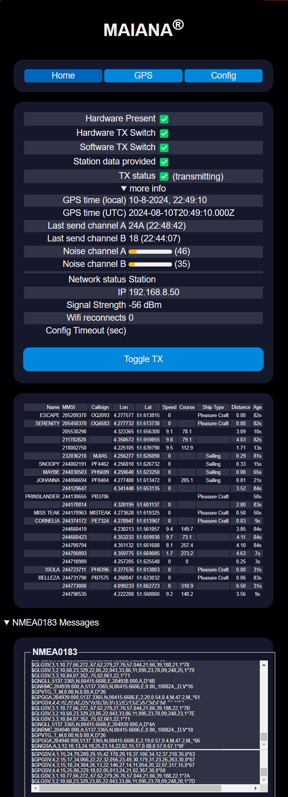
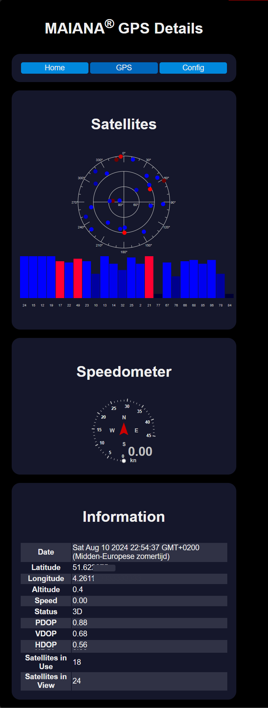

# MAIANA-WiFi

The MAIANA-WiFi project is an extension to the MAIANA AIS adapter developed by peterantypas (https://github.com/peterantypas/maiana). It leverages an ESP32 microcontroller to enable wireless communication, making it possible to use and configure the AIS system directly from a mobile device. 
It also allows for simple integration with various navigation apps, which many users prefer.

Upon making connection the ESP will send the most recent AIS messages from all ships seen in the last 10 minutes. 
This way your app will be updated quickly with the surrounding ships.

We use a ESP32 and the "USB-only" adapter by peterantypas. All messages between the serial output and the AIS will be forwarded unchanged, the ESP just listens in the middle and will add some extra messages. The adapter is expanded through an additional button "config mode". If this button is pressed, the ESP enters the configuration mode, in which it provides a unencrypted WiFi. In this WiFi the user can configure the AIS and WiFi settings. The ESP can either connect to a existing WiFi or create its own. After 5 minutes the ESP closes the connection to the configuration page and switches to normal operation mode. In the "normal" mode the ESP provides each message of the AIS over WiFi as NMEA 0183, which can be used with many apps. 

This way this adapter makes the AIS a standalone system if wanted and the user just have to plug it in and it works. If the adapter also gets a step up converter, it could be powered over USB, which makes it even more simple to use. Just grab a USB cable and a USB car plug and it works out of the box. As the configuration is made in the browser, this approach is usable with all devices, smartphones, tablets or a laptop, independent of the brand. 

## Configure WiFi settings

There are multiple ways to configure the WiFi
1) Via the webpage. Enable the config mode, this will set the MAIANA-Wifi in Access point mode and you can connect to it.
The default WiFi password for the config mode is `MAIANA-AIS`. 
When connected, browse to http://MAIANA.local/ or http://192.168.4.1 and in the config page configure the WiFi settings to connect to your network or to setup hotspot mode.
2) Via the serial port. Connect with baudrate 38400 to the ESP. Send a line with your WiFi configuration details as json e.g.: `{"ssid":"myboatsNetwork", "password":"sailingTime"}` 

## How it looks
This is the latest version of the GUI

with a config page to configure the MAIANA and other settings

with a detailed view for the GPS information

## OTA Firmware Update
Firmware can be update over-the-air OTA by going to http://MAIANA.local/update or `http://[your device ip]/update` page and select the file to upload (firmware or SPIFF file system with webpages).

Note that when the SPIFF / webpages are updated, configuration details like port setup and WiFi details will be overwritten. (not the settings on your MAIANA AIS device!)

## Included JS projects
For the webpages other projects were included. 
* GPS parsing https://github.com/infusion/GPS.js (MIT license)
* AIS parsing https://github.com/mjaros/ais-decoder (MIT license)

## Contributors

A big thank you to:

@Yamioni2007

@marcelrv

@muebau
